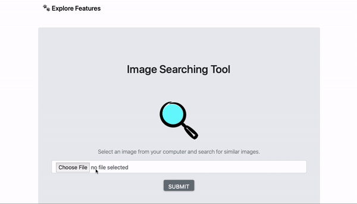

# Image Searching Engine Web App

## About

This is an image searching web app. Use pretrained VGG16 to extract feature space of images.

## Demo

### Sign Up 


### Search


## Built With

* Flask
* Keras
* HTML
* Bootstrap
* CSS

## Getting Started

Prerequisites are shown in Pipfile. 

Start Project by running shell script:
```python
$ ./job.sh
```
or
```python
$ pipenv run python3 src/features/offline.py
$ pipenv run python3 main.py
```

## Roadmap
* Deploy to Heroku
* Find a scalable way to keep all images as well as optimizing time latency.
* Explore more feature like image recognition. 
